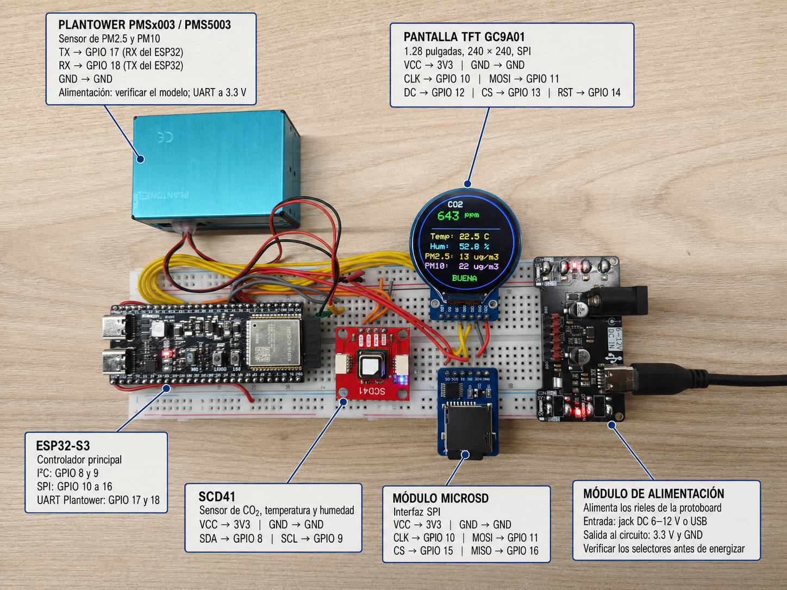
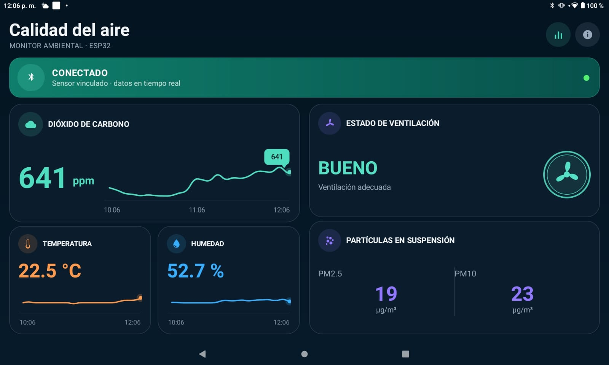
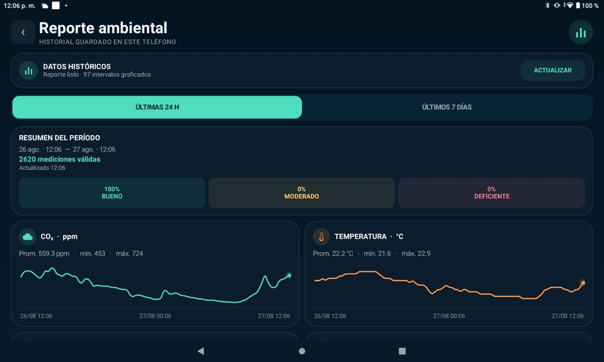
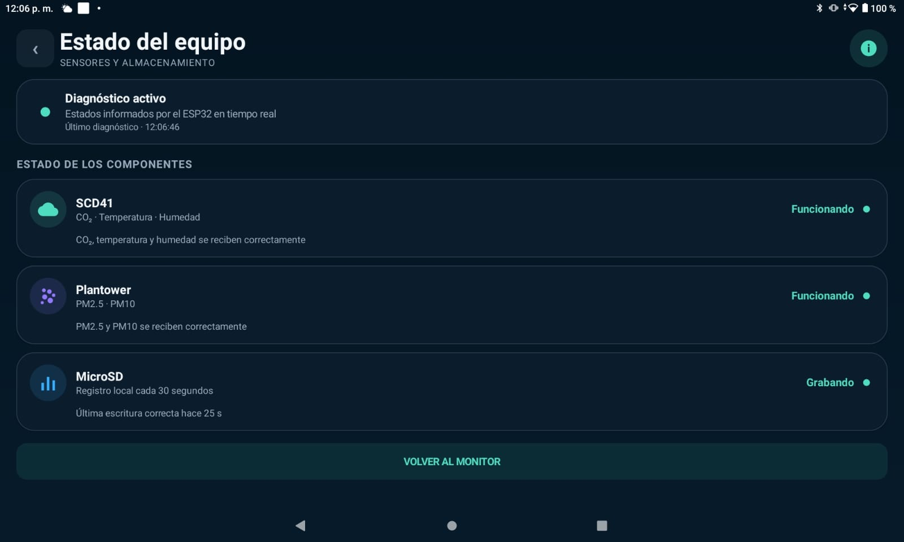

# Monitor de calidad del aire con ESP32-S3

Sistema de monitoreo ambiental basado en un ESP32-S3. Mide CO2, temperatura,
humedad y material particulado; presenta los valores en una pantalla TFT,
los registra en una microSD y los transmite en tiempo real a una aplicacion
Android mediante Bluetooth Low Energy (BLE).

## Contenido publico

Este repositorio publica el codigo fuente del firmware para el ESP32-S3 y una
APK precompilada de la aplicacion Android:

- Firmware: [`Calidad_Aire/Calidad_Aire.ino`](Calidad_Aire/Calidad_Aire.ino).
- Aplicacion Android 1.2: [`apk/CalidadAire-v1.2.apk`](apk/CalidadAire-v1.2.apk).

El codigo fuente de la aplicacion Android no forma parte de este repositorio.
La aplicacion se distribuye unicamente como APK para instalarla y usarla con
este proyecto; no se autoriza su modificacion.

## Cambios recientes

La version 1.2 de la aplicacion Android amplia el historial
local y agrega exportacion CSV. Tambien conserva el diagnostico operativo y la
compatibilidad con los canales de medicion existentes:

- El historial de reportes se guarda durante 30 dias en SQLite y puede
  consultarse sin conexion al ESP32.
- Al volver a abrir la app, los graficos principales recuperan desde SQLite
  las dos horas previas a la ultima muestra local e indican su fecha y hora.
- Los periodos de 24 horas, 7 dias y 30 dias pueden exportarse como CSV desde
  el selector de archivos de Android, sin permisos de almacenamiento.
- La interfaz Android organiza el monitor en tiempo real, el reporte ambiental
  y el diagnostico del equipo en pantallas adaptadas para telefono y tablet.
- Un nuevo canal BLE opcional informa cada dos segundos el estado del SCD41,
  Plantower y microSD.
- El firmware ya no usa Wi-Fi, NTP ni HTTPS, ni indexa la microSD durante el
  arranque; la hora llega exclusivamente desde Android por BLE.
- El SCD41 se consulta sin bloquear el `loop()` y cuenta con recuperacion
  automatica ante esperas prolongadas o errores I2C consecutivos.
- La microSD solo se considera `Grabando` tras confirmar una escritura y
  vaciarla correctamente.
- Los graficos permiten seleccionar muestras por toque, arrastre, teclado o
  servicios de accesibilidad para consultar su hora, valor y unidad.
- El montaje y las pantallas principales de la app quedan documentados con
  fotografias reales en la galeria del proyecto.

## Galeria del proyecto

### Montaje fisico y componentes

[](docs/images/montaje-componentes.png)

El prototipo integra el ESP32-S3, el sensor SCD41, el Plantower PMSx003/PMS5003,
la pantalla TFT GC9A01, el modulo microSD y el modulo de alimentacion. La imagen
indica las conexiones principales y los GPIO utilizados por cada componente.

### Aplicacion Android

#### Monitor principal

[](docs/images/app-monitor-principal.jpeg)

La pantalla principal presenta las mediciones en tiempo real, los graficos de
CO2, temperatura y humedad, la concentracion de particulas y el estado de
ventilacion.

| Reporte ambiental | Estado del equipo |
|:---:|:---:|
| [](docs/images/app-reporte-ambiental.jpeg) | [](docs/images/app-estado-equipo.jpeg) |
| Resume el periodo, las mediciones validas, la ventilacion y las tendencias. La version 1.2 agrega tambien el periodo de 30 dias y `EXPORTAR CSV`. | Informa en tiempo real el funcionamiento del SCD41, Plantower y microSD, incluida la ultima escritura correcta. |

Las imagenes se pueden abrir para verlas a tamano completo.

## Funcionalidades

- Medicion de CO2, temperatura y humedad con un Sensirion SCD41.
- Medicion de PM2.5 y PM10 con un Plantower PMSx003/PMS5003.
- Visualizacion local en pantalla redonda GC9A01 de 240 x 240 pixeles.
- Registro CSV de respaldo en una tarjeta microSD, sin leerla para reportes.
- Transmision de todas las mediciones mediante BLE.
- Aplicacion Android con indicadores visuales y actualizacion en tiempo real.
- Historial SQLite persistente en el telefono con retencion automatica de 30 dias.
- Reportes de 24 horas, 7 dias o 30 dias calculados desde el historial local.
- Exportacion CSV del periodo seleccionado.
- Sincronizacion del reloj del ESP32 con la hora del telefono mediante BLE.
- Conexion BLE conservada al girar la pantalla del telefono.
- Panel de diagnostico en vivo para sensores y almacenamiento.
- Inicializacion del SCD41 con estados visibles y limite de espera I2C.

## Estructura del proyecto

```text
CalidadAireEsp32S3Publico/
|- .gitattributes                              Marca la APK como archivo binario
|- .gitignore                                  Excluye el proyecto Android local
|- Calidad_Aire/
|  `- Calidad_Aire.ino                         Firmware completo
|- apk/
|  `- CalidadAire-v1.2.apk                     Aplicacion Android precompilada
|- docs/images/                                Fotografias del montaje y la app
`- README.md
```

## Componentes

- ESP32-S3.
- Sensor Sensirion SCD41.
- Sensor Plantower PMSx003/PMS5003.
- Pantalla TFT redonda GC9A01, 1.28 pulgadas, 240 x 240.
- Modulo lector de microSD compatible con 3.3 V.
- Modulo de alimentacion para protoboard configurado para entregar 3.3 V.
- Tarjeta microSD formateada en FAT32.

## Conexiones

### SCD41 por I2C

| SCD41 | ESP32-S3 |
|---|---:|
| VCC | 3V3 |
| GND | GND |
| SDA | GPIO 8 |
| SCL | GPIO 9 |

### Pantalla GC9A01 por SPI

| Pantalla | ESP32-S3 |
|---|---:|
| VCC | 3V3 |
| GND | GND |
| SCL / CLK | GPIO 10 |
| SDA / MOSI | GPIO 11 |
| DC | GPIO 12 |
| CS | GPIO 13 |
| RST | GPIO 14 |

Los pines llamados `SCL` y `SDA` en esta pantalla corresponden al bus SPI;
no son los pines I2C del SCD41.

### Modulo microSD por SPI

| MicroSD | ESP32-S3 |
|---|---:|
| VCC | 3V3 |
| GND | GND |
| CLK | GPIO 10 |
| MOSI / DI /SI| GPIO 11 |
| CS | GPIO 15 |
| MISO / DO / SO | GPIO 16 |

La pantalla y la microSD comparten CLK y MOSI, pero cada una tiene su propio CS.

### Sensor Plantower por UART

| Plantower | ESP32-S3 |
|---|---:|
| TX | GPIO 17, RX del ESP32 |
| RX | GPIO 18, TX del ESP32 |
| GND | GND |

Verificar el voltaje requerido por el modelo exacto del sensor Plantower. Las
senales UART hacia el ESP32 deben ser compatibles con 3.3 V.

## Bibliotecas de Arduino

Instalar desde el gestor de bibliotecas:

- `Sensirion I2C SCD4x`
- `Adafruit GFX Library`
- `Adafruit GC9A01A`

Las bibliotecas de SD y BLE utilizadas pertenecen al paquete oficial de
placas ESP32. El firmware final usa la biblioteca BLE original del core ESP32,
no `NimBLE-Arduino`.

### Configuracion de compilacion

El firmware completo supera el espacio de la particion predeterminada. En
Arduino IDE seleccionar:

```text
Herramientas -> Partition Scheme -> Huge APP (3MB No OTA/1MB SPIFFS)
```

Tambien puede utilizarse una opcion `No OTA` con al menos 2 MB para la
aplicacion. Esta configuracion no modifica los archivos de la microSD.

## Registro en la microSD

El firmware mide y actualiza la pantalla/Bluetooth aproximadamente cada 5
segundos. En RAM acumula una ventana de 30 segundos y crea:

```text
/calidad_aire_30s.csv
```

Cada fila contiene cantidad de muestras, promedios, minimos y maximos de CO2
y particulas, y los conteos de ventilacion:

```csv
fecha_hora,muestras,co2_promedio_ppm,co2_min_ppm,co2_max_ppm,temperatura_promedio_c,humedad_promedio_pct,pm25_muestras,pm25_promedio_ug_m3,pm25_min_ug_m3,pm25_max_ug_m3,pm10_muestras,pm10_promedio_ug_m3,pm10_min_ug_m3,pm10_max_ug_m3,vent_buenas,vent_moderadas,vent_deficientes
2026-07-28 16:30:00,6,450.5,442,461,25.40,43.50,6,8.2,7,10,6,14.2,13,16,6,0,0
```

El archivo anterior `/calidad_aire_con_fecha.csv` no se elimina ni se sigue
ampliando. Permanece solamente como respaldo. El firmware no recorre, indexa
ni transmite por BLE el contenido de la tarjeta.

Si la apertura o escritura del nuevo CSV falla, el acumulado permanece en RAM
y se vuelve a intentar con la siguiente medicion. Un corte de energia puede
perder como maximo la ventana de 30 segundos que aun no se haya escrito.

Una trama PM valida se conserva durante un maximo de 60 segundos para cubrir
sensores o modos de trabajo con actualizacion lenta. Despues de cada escritura,
el monitor serie informa los promedios y la cantidad de muestras PM guardadas;
si no recibio ninguna trama UART valida muestra `CSV sin PM`.

La inicializacion valida tanto el montaje de la tarjeta como la apertura real
del archivo para escritura. La pantalla muestra si la microSD fue iniciada o
si ocurrio un error. La app solo muestra `Grabando` despues de confirmar una
fila escrita y vaciada correctamente; si pasan mas de 45 segundos sin otra
escritura valida, muestra un error en lugar de confundir tarjeta montada con
grabacion activa.

## Fecha y hora sin NTP

El firmware no utiliza Wi-Fi, NTP ni HTTPS. Al conectarse la aplicacion, el
telefono envia su hora Unix por BLE y el ESP32 ajusta
inmediatamente su reloj usando la zona horaria de Chile. La TFT confirma el
ajuste con el mensaje `HORA MOVIL / LISTA`.

La zona horaria se configura para Chile. Si no se logra obtener la hora, el
CSV registra `SIN_HORA` en lugar de inventar una fecha.

Las filas guardadas antes de conectar el telefono pueden contener `SIN_HORA`.
La app usa el reloj propio de Android para fechar su historial local.

## Clasificacion del CO2

El CO2 se utiliza como indicador de ventilacion interior, no como una medicion
completa de todos los contaminantes del aire.

| CO2 | Estado | Interpretacion |
|---:|---|---|
| Menos de 800 ppm | Buena | Ventilacion adecuada |
| 800 a 1000 ppm | Moderada | Conviene aumentar el aire exterior |
| Mas de 1000 ppm | Deficiente | Probable ventilacion insuficiente |

Los rangos se basan en orientaciones de
[CDC/NIOSH sobre ventilacion](https://www.cdc.gov/niosh/ventilation/faq/index.html)
y en la
[guia NIOSH de evaluacion del aire interior](https://stacks.cdc.gov/view/cdc/180005/cdc_180005_DS1.pdf).

## Comunicacion Bluetooth Low Energy

El ESP32 se anuncia como:

```text
CalidadAire-S3
```

### UUID

```text
Servicio:  e4f14c00-7f7a-4a50-8c1a-3c1d2e3f4001
Ambiente:  e4f14c01-7f7a-4a50-8c1a-3c1d2e3f4001
PM:        e4f14c02-7f7a-4a50-8c1a-3c1d2e3f4001
Comandos:  e4f14c03-7f7a-4a50-8c1a-3c1d2e3f4001
Estado:    e4f14c05-7f7a-4a50-8c1a-3c1d2e3f4001
```

El canal de ambiente transmite:

```text
CO2|temperatura|humedad|estado
450|25.4|43.5|B
```

El canal de particulas transmite:

```text
PM2.5|PM10
8|14
```

Los estados son `B` para buena, `M` para moderada y `D` para deficiente. Los
canales de ambiente y particulas permiten notificaciones. El descriptor
`0x2902` permite que Android se suscriba a los nuevos valores.

El canal opcional `Estado` permite lectura y notificaciones cada dos segundos:

```text
H|scd|pm|sd|edad_ultima_escritura_seg
H|1|1|1|12
```

Para SCD41, Plantower y microSD, `0` significa error o no operativo, `1`
significa funcionando (o grabando, para la SD) y `2` significa iniciando o
esperando la primera confirmacion. La edad vale `-1` mientras no exista una
escritura correcta. Al usar un firmware anterior sin este UUID, las mediciones
siguen funcionando y la app indica que el diagnostico no esta disponible.

Al desconectarse el telefono, el ESP32 vuelve a iniciar automaticamente su
anuncio BLE.

### Hora por BLE e historial local

El canal `Comandos` acepta escritura:

```text
T|epoch
```

La app envia `T` automaticamente despues de preparar la conexion. Cada 30
segundos guarda en SQLite una muestra con CO2, temperatura, humedad,
clasificacion y la hora del telefono; incorpora PM2.5 y PM10 cuando la trama
de particulas esta disponible. La limpieza conserva solamente los ultimos 30
dias.

Los reportes se consultan en un ejecutor de fondo para no bloquear la interfaz:
24 horas se agrupan en intervalos de 15 minutos, 7 dias en intervalos de una
hora y 30 dias en intervalos de seis horas. Funcionan aunque el ESP32 este
desconectado porque no realizan ninguna lectura BLE o de microSD.

Cerrar o forzar la detencion de la app no borra la base SQLite. Al abrirla de
nuevo, los graficos principales recuperan las dos horas anteriores a la ultima
muestra disponible y muestran cuando fue registrada, aunque sea antigua. A una
muestra cada 30 segundos, 30 dias representan hasta 86.400 filas y
aproximadamente 7 a 12 MB, segun la disponibilidad de PM y la sobrecarga de
SQLite. Es un equilibrio razonable entre detalle y espacio. Para
conservar periodos mayores se recomienda exportar un CSV antes de que venza la
retencion.

### Exportar el historial

1. Abrir el reporte desde el icono de historial.
2. Elegir `24 H`, `7 DIAS` o `30 DIAS`.
3. Pulsar `EXPORTAR CSV` y seleccionar el destino en Android.

La exportacion escribe cada muestra local del periodo directamente desde
SQLite, sin cargar todo el archivo en memoria y sin solicitar permiso de
almacenamiento. Incluye fecha local con zona horaria, epoch en milisegundos,
CO2, temperatura, humedad, PM2.5, PM10 y clasificacion de ventilacion. Si no
hay particulas en una muestra, sus campos quedan vacios. El CSV contiene el
historial del telefono, no importa datos anteriores desde la microSD.

La app solo puede incorporar mediciones mientras esta abierta y conectada al
sensor. Si permanece cerrada, el ESP32 continua guardando el respaldo en la
microSD, pero la app no importa posteriormente esas filas. Desinstalar la app
o borrar sus datos elimina el historial SQLite del telefono.

## Permisos y conexion en Android

- En Android 12 o posterior, conceder el permiso de Dispositivos cercanos.
- En Android 11 o anterior, conceder el permiso de Ubicacion y mantener la
  ubicacion del telefono activada durante el escaneo BLE.
- La app detecta el equipo por el nombre `CalidadAire-S3` y mantiene la
  conexion BLE al girar la pantalla.

Si la app no encuentra el ESP32 despues de actualizarla, reinstalar la APK y
volver a conceder los permisos solicitados.

## Interfaz Android

- Paleta oscura en tonos petroleo y turquesa.
- Iconos PNG transparentes generados para CO2, temperatura, humedad,
  ventilacion, particulas y Bluetooth.
- Boton de conexion ubicado en la parte superior.
- La lista de dispositivos detectados permanece oculta.
- Diseno adaptable: en tablets y pantallas anchas las tarjetas se distribuyen
  en dos columnas; en telefonos se prioriza el desplazamiento vertical.
- Solamente la zona de mediciones puede desplazarse en pantallas pequenas.
- Estados visibles: buscando, conectando, conectado y reconectar.
- El icono de informacion abre el estado en vivo de SCD41, Plantower y microSD.
- Los graficos permiten tocar o arrastrar para seleccionar la muestra mas
  cercana y muestran hora, valor y unidad. Tambien admiten navegacion con
  teclado o servicios de accesibilidad sin bloquear el desplazamiento vertical.
- Los graficos en vivo cubren las ultimas dos horas y consolidan un punto por
  intervalo de cinco minutos; al volver a abrir la app, se restauran alrededor
  de la ultima muestra disponible en SQLite.
- Acceso a reportes desde el icono de historial de la cabecera.
- Filtros `24 H`, `7 DIAS` y `30 DIAS`.
- Boton `EXPORTAR CSV` disponible sin conexion al sensor.
- Reportes disponibles sin conexion, obtenidos desde SQLite en segundo plano.
- Porcentajes de ventilacion buena, moderada y deficiente.
- Promedio, minimo, maximo y graficos con las horas reales de cada periodo.
- La pantalla de reporte se superpone dentro de la misma actividad, por lo que
  abrirla o cerrarla no interrumpe la conexion Bluetooth.

### Instalar la aplicacion

La aplicacion 1.2 admite Android 6.0 o posterior.

1. Descargar [`CalidadAire-v1.2.apk`](apk/CalidadAire-v1.2.apk).
2. Abrir el archivo en el telefono y, si Android lo solicita, autorizar a la
   aplicacion usada para descargarlo a instalar aplicaciones desconocidas.
3. Instalar la APK y conceder los permisos Bluetooth indicados en la seccion
   anterior.
4. Encender el monitor y pulsar el boton de conexion de la app.

SHA-256 de la APK publicada:

```text
8377CC3D3915090D9CD3A679B583F5FB9680A77790971276A47C0E8A3B3E53C9
```

## Diagnostico rapido

| Problema | Revision recomendada |
|---|---|
| La app no encuentra el ESP32 | Instalar la APK mas reciente, conceder Dispositivos cercanos y reiniciar el escaneo |
| Android 11 o anterior no escanea | Activar Ubicacion y conceder su permiso |
| Error BLE `1` | Ya existe un escaneo activo; detenerlo antes de iniciar otro |
| La app se desconecta al girar | Actualizar o reinstalar la APK publicada en este repositorio |
| El sketch no cabe | Seleccionar `Huge APP` o una particion `No OTA` |
| La SD no inicia | Usar FAT32, revisar CS GPIO 15, MISO GPIO 16 y alimentacion |
| Aparece NACK del SCD41 al despertar | Puede ocurrir en `wakeUp`; si luego lee el numero de serie y mide, no es fatal |
| La hora no se sincroniza | Conectar la app para que envie la hora por BLE |
| El reporte aparece vacio | Mantener la app conectada para generar registros nuevos; consultar registros existentes no requiere conexion |
| El historial no avanza con la app cerrada | Es el comportamiento actual: el telefono solo registra con la app abierta y BLE conectado; la microSD continua como respaldo independiente |
| El historial desaparecio tras reinstalar | Desinstalar o borrar los datos de la app elimina SQLite; exportar periodicamente para conservar una copia externa |
| No se puede exportar el CSV | Elegir un proveedor o carpeta con permiso de escritura y espacio disponible |
| El diagnostico no esta disponible | El firmware conectado es anterior; las mediciones siguen funcionando, pero debe cargarse el INO actual para ver estados detallados |
| PM aparece como `--` o el CSV de la microSD muestra `-1` | Buscar `CSV sin PM` en el monitor y revisar UART, cruce TX/RX, baudrate 9600 y checksum; la exportacion Android deja esos campos vacios |

## Comportamiento no bloqueante

- Se eliminaron la conexion Wi-Fi, la consulta HTTPS y la indexacion completa
  de la microSD durante el arranque.
- La TFT muestra la etapa exacta del SCD41 y el bus I2C tiene un tiempo maximo
  de espera de 80 ms por operacion.
- Mientras se forma la primera muestra, la TFT muestra los segundos
  transcurridos. Si no llega en 12 segundos, reinicia automaticamente la
  medicion periodica; tambien recupera una interrupcion posterior de 15 s.
- Cinco errores I2C consecutivos activan la recuperacion y la pantalla muestra
  `ERROR I2C` en lugar de permanecer indefinidamente en `LISTO`.
- El `loop()` consulta disponibilidad del SCD41 cada 250 ms y sigue atendiendo
  UART y BLE; ya no espera cinco segundos entre mediciones.
- `stopPeriodicMeasurement()` conserva solamente su espera interna de 500 ms,
  requerida por el SCD41; se elimino una segunda espera duplicada de 600 ms.

## Alimentacion

El ESP32-S3, la TFT, la microSD y los sensores pueden producir picos de
consumo. Utilizar una fuente estable y con corriente suficiente, respetando el
voltaje de cada modulo y compartiendo GND entre todos ellos. Una alimentacion
insuficiente puede provocar reinicios, errores de SD o desconexiones Bluetooth.
En el modulo de alimentacion mostrado en la fotografia, comprobar los selectores
y confirmar una salida de 3.3 V antes de energizar los rieles de la protoboard.
